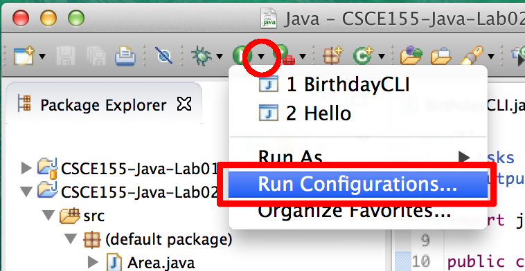

# Computer Science I
## Lab 2.0 - Basics
### Java Version
[School of Computing](https://computing.unl.edu)  
[College of Engineering](https://engineering.unl.edu/)  
[University of Nebraska-Lincoln](https://unl.edu)  

This lab introduces you to the basics of a Java program
including fundamental variable types, arithmetic operators,
standard input/output, and non-interactive input.

## Prior to Lab

Before attending this lab:

1.  Read and familiarize yourself with this handout.

2.  Read the required chapters(s) of the textbook as outlined in the
    course schedule.

## Peer Programming Pair-Up

***For students in online section(s):*** you may complete
the lab on your own if you wish or you may team up with a partner
of your choosing, or, you may consult with a lab instructor to get
teamed up online (via Zoom).

***For students in the on campus section:*** your lab instructor
may team you up with a partner.  

To encourage collaboration and a team environment, labs are be
structured in a *peer programming* setup.  At the start of
each lab, you will be randomly paired up with another student
(conflicts such as absences will be dealt with by the lab instructor).
One of you will be designated the *driver* and the other
the *navigator*.  

The navigator will be responsible for reading the instructions and
telling the driver what to do next.  The driver will be in charge of the
keyboard and workstation.  Both driver and navigator are responsible
for suggesting fixes and solutions together.  Neither the navigator
nor the driver is "in charge."  Beyond your immediate pairing, you
are encouraged to help and interact and with other pairs in the lab.

Each week you should alternate: if you were a driver last week,
be a navigator next, etc.  Resolve any issues (you were both drivers
last week) within your pair.  Ask the lab instructor to resolve issues
only when you cannot come to a consensus.  

Because of the peer programming setup of labs, it is absolutely
essential that you complete any pre-lab activities and familiarize
yourself with the handouts prior to coming to lab.  Failure to do
so will negatively impact your ability to collaborate and work with
others which may mean that you will not be able to complete the
lab.  

## Lab Objectives & Topics  

At the end of this lab you should be familiar with the following

-   Using command line arguments

-   How to declare and use variables

-   Basic primitive data types

-   How to choose appropriate data types for a given problem

# Activities

To get the starter code for this lab, clone the following project
from GitHub using Eclipse (review instructions if you need to from
the first lab).

<https://github.com/cbourke/CSCE155-Java-Lab02>

## Using Command Line Arguments (in Eclipse)

When you run a program from the command line, you can also provide the
program with *arguments* that the program can use for input or for
configuration. To understand this, we have provided you two completed
programs that compute an age given a birthdate. The first works by
*prompting* the user for input interactively, while the second uses
command line arguments.

### Instructions

1.  Open and run the `Birthday.java` program and answer the questions
    on your worksheet.  Note: the program will *prompt& for input in
    Eclipse's Console window; change your focus to that window and
    type the input (which should appear in green).

2.  The second program, `BirthdayCLI.java` is non-interactive: it reads
    input directly from the command line when you run it.  With an IDE,
    there is no direct command line, but it is still possible to work with
    it:

    a. Run the program once by clicking the "play" button.  An error should
       be printed because the program expected command line arguments but
       we didn't give it any.  

    b. To use command line arguments (CLAs) we need to create a *run configuration*.
       Click the play button's down arrow and select "Run Configurations":

       

    c. Click the "Arguments" tab and enter the command line arguments as follows:  
       `James 1955 5 19`

    d. Click "Apply" then "Run"

3.  Answer the questions on your worksheet.

## Basic Data Types

A variable is a name associated with a memory cell whose value can
change. When variables are stored in memory, the computer has to have a
way of knowing what type of data is stored in a given variable. Data
types identify the type of values stored in a memory location and
operations that can be performed on those values. A computer will not
use the same amount of memory to store a single letter as it does to
store a very large real number, and the values are not going to be
interpreted the same way. Therefore, different data types may have
different sizes. The (incomplete) table in question 4 on the worksheet
shows some basic data types with their sizes and ranges. Size is
represented in bytes. A byte is a unit of storage capable of holding a
single character. A byte is usually considered equal to 8 bits. A bit
(short for binary digit), is the smallest unit of information in a
computer--either a zero or a one. Some basic data types can be either
signed (either positive or negative) or unsigned (non-negative).

Java is a *statically-typed* language.  All variables *must* be declared
by giving them a type and a name before they can be used.  Declarations
can optionally be followed by an assignment in the same line.  Some
examples:

```java
int a;
int b = 10;
int c, d = 5, e;
double x, pi = 3.14;
```

For basic data types (called primitive data types), Java specifies exactly
how many bytes each type takes and consequently defines a fixed range
for each type.  A Java program has been provided, `Ranges.java` that
demonstrates the size and range of each basic data type.

### Instructions

1.  Open the source file `Ranges.java` in your Eclipse project and run it.

2.  Complete the table provided in your worksheet

## Currency Conversion

Write a program that will convert US Dollars to British Pounds (GBP) and
Japanese (JPY). 10% of the total amount of US Dollars will be taken as an
exchange fee. For the rest of the US Dollars, **half** will be changed to
British Pounds and the other half to JPY. Assume the exchange rate is: 1
US Dollar = 0.79 British Pound; 1 US Dollar = 127.65 JPY. The program
should ask the user to input the amount of US dollars then print an
appropriate output.  Both GBP and dollar units should be output to two
decimal points.  However, Yen are not divisible units so its output
should only be a whole number.  

An example run would look *something* like the
following:

```text
Please input the total amount of US Dollars: 100.00
Fee (10%): $10.00
You get:
35.55 GBP
5744 JPY
```

### Instructions

1.  Create a new source file named `Dollar.java` in the `unl.soc` package.

2.  Write a complete Java program in this source file.  Be sure to
  	place your code in a `main` method and
    to choose appropriate data types for your variables.

3.  Compile and run your program and answer the questions in your worksheet.

## Mixed types

A mixed-type expression is an expression with operands of different data
types. When an assignment statement is executed, the expression on the
right-hand-side is evaluated, and then the resulting value is placed
into the variable on the left-hand-side. For example:

```java
int x = (8 * 4) + (3 * .5);
```

The data types of the operand affect the data type of the result. This
can lead to some initially unintuitive results. When performing division
between two integers, the result is necessarily an integer. For example:

```java
int a = 10, b = 20, c;
c = a / b;
```

In the code snippet above, the floating point result of `10 / 20`
*should* be `0.5`, but the actual value stored in the variable
`c` is zero! This is because the result of an operation of two
integers is an integer: thus the decimal part of the result is truncated
(dropped). We could fix this by making at least one of the operands (and
the resulting variable) a floating point variable through type-casting:

```java
int a = 10, b = 20;
double c;
c = (double) a / b;
```

You have been given a program, `Area.java` that reads in the base
and the height of a triangle and calculates the total area.

1.  Read through and understand the source code

2.  Compile and run your program to answer the remaining questions in
    your worksheet, making sure to *fix* the program so that it is
    correct.

3.  Using the previous birthday programs as a reference, change the area
    program to accept command line arguments instead of prompting for
    input.

    Command line inputs are communicated through the `args` parameter in
    the `main` method (which is an array of strings). Each argument can be
    accessed by indexing this array with zero being the first index (so
    the arguments are stored in `args[0]`, `args[1]`, etc.).
    To convert these strings to numeric values you can use conversion
    methods:

    ```java
    int a = Integer.parseInt(args[0]);
    double b = Double.parseDouble(args[1]);
    ```

# Handin/Grader Instructions

1.  Hand in your completed files:

    -   `Dollar.java`

    -   `Area.java`

    You should have completed your worksheet, but you won't be handing
    it in.  Be sure your program(s) pass all tests to get credit.

2.  Even if you worked with a partner, you *both* should turn in all
    files.

# Advanced Activities (Optional)

Many applications require the use of numerical values greater than or with
greater precision than what 32-bit signed integers and 64-bit floating point
numbers can represent.  It is typical to use a multi-precision library that offers
integers and floating point number types with arbitrary precision but with a
greater performance cost.  Java offers several classes as part of its Standard
Developer Kit (SDK): `BigInteger` (see <http://docs.oracle.com/javase/8/docs/api/java/math/BigInteger.html>)
and `BigDecimal` (see <http://docs.oracle.com/javase/8/docs/api/java/math/BigDecimal.html>).  
Read the provided documentation and modify your program to use these
types instead so that US National Debt can be represented and correctly
converted to Yen.
